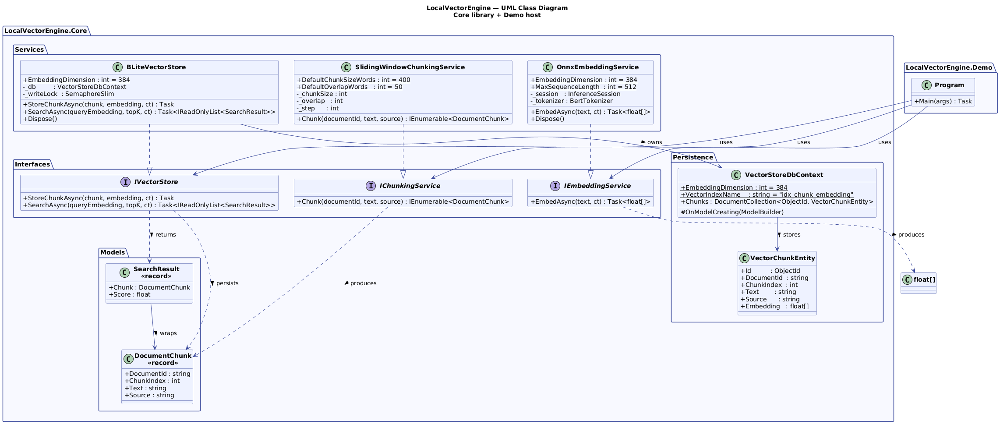
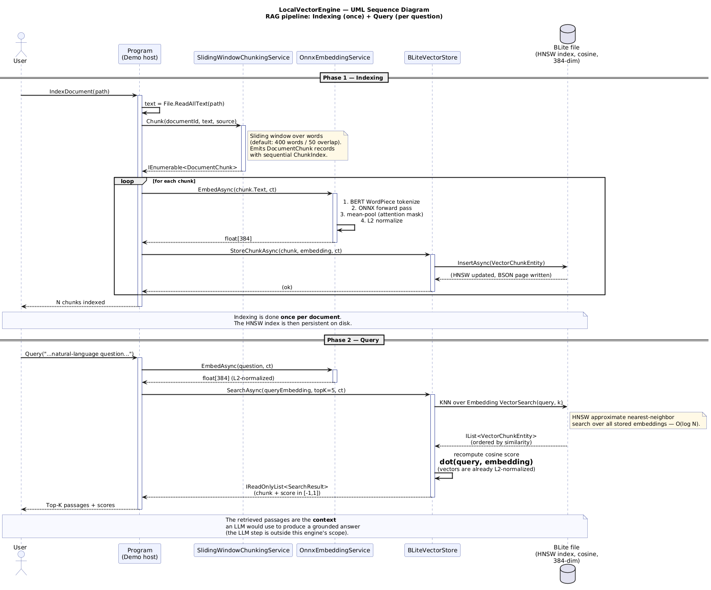

# LocalVectorEngine — Local Vector Search Engine for RAG

## Problem

LLMs have a knowledge cut-off and don't know about *your* documents. The **RAG** (Retrieval-Augmented Generation) pattern solves this in two phases: first you index the documents by turning them into embedding vectors; then, for every question, you retrieve the most similar chunks and pass them to the LLM as grounded context.

This repository provides **the vector search engine** — the "retrieval" half of RAG — as a reusable library. It is designed to be consumed by two separate projects:

- *AI Document Q&A* — a RAG application that answers questions over PDF/TXT/MD documents
- *BLite Mobile + AI* — a .NET MAUI app that indexes documents locally on a phone

## Architecture

The repository is organised as **one shared library** plus **one console demo** that exercises the full pipeline end-to-end.

```
src/
├── LocalVectorEngine.Core/              ← public library (the "product")
│   ├── Interfaces/
│   │   ├── IChunkingService.cs          ← splits a document into chunks
│   │   ├── IEmbeddingService.cs         ← text → float[] (vector)
│   │   └── IVectorStore.cs              ← persistence + HNSW search
│   ├── Models/
│   │   ├── DocumentChunk.cs             ← immutable chunk record
│   │   └── SearchResult.cs              ← chunk + similarity score
│   ├── Services/
│   │   ├── SlidingWindowChunkingService.cs  ← sliding window chunker
│   │   ├── OnnxEmbeddingService.cs          ← ONNX + MiniLM embedder
│   │   └── BLiteVectorStore.cs              ← BLite HNSW vector store
│   ├── Indexing/
│   │   └── DocumentIndexer.cs           ← indexing pipeline orchestrator
│   ├── Retrieval/
│   │   └── RetrievalEngine.cs           ← query pipeline orchestrator
│   └── Persistence/
│       ├── VectorChunkEntity.cs         ← BLite BSON entity
│       └── VectorStoreDbContext.cs       ← BLite DB context + HNSW config
│
└── LocalVectorEngine.Demo/              ← CLI demo app
    └── Program.cs                       ← index / query / demo commands
```

### Core contracts

```csharp
public interface IChunkingService
{
    IEnumerable<DocumentChunk> Chunk(string documentId, string text, string source);
}

public interface IEmbeddingService
{
    Task<float[]> EmbedAsync(string text, CancellationToken ct = default);
}

public interface IVectorStore
{
    Task StoreChunkAsync(DocumentChunk chunk, float[] embedding, CancellationToken ct = default);
    Task<IReadOnlyList<SearchResult>> SearchAsync(float[] queryEmbedding, int topK, CancellationToken ct = default);
}

public record DocumentChunk(string DocumentId, int ChunkIndex, string Text, string Source);
public record SearchResult(DocumentChunk Chunk, float Score);
```

The async methods take a `CancellationToken` to match the Zucchetti-7 spec and to make timeout/abort behaviour explicit on both server and mobile.

### High-level orchestrators

The library exposes two orchestrators that wire the three core services together, so callers don't have to manage the pipeline manually:

- **`DocumentIndexer`** — indexing side: `Chunk → Embed → Store` for each document.
- **`RetrievalEngine`** — query side: `Embed question → k-NN Search → return top-K results`.

## RAG pipeline

```
INDEXING (run once per document)

  Source document
        │
        ▼
  IChunkingService         ── sliding window: 100 words, 25 overlap
        │
        ▼
  IEmbeddingService        ── text → float[384]  (ONNX, local)
        │
        ▼
  IVectorStore.Store       ── persist into BLite (HNSW, cosine)


QUERY (run for every user question)

  Question
        │
        ▼
  IEmbeddingService        ── question → float[384]
        │
        ▼
  IVectorStore.Search      ── HNSW: top-K most similar chunks
        │
        ▼
  SearchResult[] (chunk + score)  ── ready to feed an LLM as context
```

## Tech stack

| Component | Technology | Notes |
|---|---|---|
| Runtime | .NET 10 | |
| Embedding | ONNX Runtime + `all-MiniLM-L6-v2` | 384-dim, runs locally |
| Vector DB | BLite 4.3.0 | Built-in HNSW index, cosine metric |
| Testing | xUnit 2.9.3 + SkippableFact | 84 tests, model-dependent tests auto-skip |
| Diagrams | PlantUML | Sources in `docs/` |

No cloud calls — all retrieval runs on-device.

## Implementation status

| Component | Interface | Implementation | Issue |
|---|---|---|---|
| Chunking | ✅ `IChunkingService` | ✅ `SlidingWindowChunkingService` | #21 |
| Embedding | ✅ `IEmbeddingService` | ✅ `OnnxEmbeddingService` | #10 |
| Vector store | ✅ `IVectorStore` | ✅ `BLiteVectorStore` | #11 |
| Indexing pipeline | — | ✅ `DocumentIndexer` | #12 |
| Retrieval engine | — | ✅ `RetrievalEngine` | #13 |
| CLI interface | — | ✅ `Program.cs` (index / query / demo) | #16 |
| Unit tests | — | ✅ 84 tests (edge cases + integration) | #15 |

## How to run

### 1. Download the ONNX model

Download the model **and** its tokenizer vocabulary into `models/` (both are gitignored):

```bash
# 86 MB ONNX model
curl -L -o models/all-MiniLM-L6-v2.onnx \
  https://huggingface.co/sentence-transformers/all-MiniLM-L6-v2/resolve/main/onnx/model.onnx

# 232 KB BERT WordPiece vocabulary
curl -L -o models/vocab.txt \
  https://huggingface.co/sentence-transformers/all-MiniLM-L6-v2/resolve/main/vocab.txt
```

### 2. Build

```bash
dotnet build
```

### 3. Run the CLI

The demo app provides three commands:

```bash
# Run the built-in demo (indexes sample doc + runs 3 queries)
dotnet run --project src/LocalVectorEngine.Demo -- demo

# Index a specific file
dotnet run --project src/LocalVectorEngine.Demo -- index path/to/document.txt

# Query the indexed documents
dotnet run --project src/LocalVectorEngine.Demo -- query "What is HNSW?"
```

### 4. Run the test suite

```bash
# 84 tests — model-dependent tests auto-skip if models/ is empty
dotnet test
```

### Environment variables

| Variable | Default | Description |
|---|---|---|
| `LVE_MODEL_PATH` | `models/all-MiniLM-L6-v2.onnx` | Path to the ONNX model file |
| `LVE_VOCAB_PATH` | `models/vocab.txt` | Path to the BERT WordPiece vocabulary |
| `LVE_DB_PATH` | `data/vectorstore.db` | Path to the BLite database file |

### Example output

```
╔══════════════════════════════════════════════════╗
║  LocalVectorEngine — End-to-End Demo            ║
╚══════════════════════════════════════════════════╝

Indexing rag_overview.txt … 7 chunks stored.

Q: What is Retrieval-Augmented Generation?
  [1] score=0.6234  chunk#0  "Retrieval-Augmented Generation (RAG) is an AI architecture…"
  [2] score=0.4812  chunk#1  "The RAG pipeline has two main phases…"

Q: How does HNSW search work?
  [1] score=0.5891  chunk#3  "HNSW is a graph-based algorithm that builds a multi-layer…"
  [2] score=0.4103  chunk#2  "Vector similarity search is the core of the retrieval step…"
```

## Repository layout

```
Exam/
├── src/                          source code
│   ├── LocalVectorEngine.Core/   shared library
│   └── LocalVectorEngine.Demo/   CLI demo app
├── tests/                        84 unit + integration tests
├── docs/                         UML diagrams (PlantUML + PNG)
├── samples/                      sample documents for demo
├── models/                       ONNX model (gitignored)
├── data/                         BLite database (gitignored)
├── LocalVectorEngine.slnx        solution file
└── README.md
```

## Test suite

The project includes **84 tests** across 7 test classes:

| Test class | Tests | Scope |
|---|---|---|
| `SlidingWindowChunkingServiceTests` | 11 | Chunker constructor, sliding behaviour, overlap, whitespace |
| `SlidingWindowChunkingEdgeCaseTests` | 8 | Unicode, CJK, single word, exact size, extreme overlap |
| `OnnxEmbeddingServiceTests` | 4 | Dimension, L2 norm, semantic similarity (SkippableFact) |
| `BLiteVectorStoreTests` | 11 | Validation, round-trip, persistence, dispose |
| `BLiteVectorStoreEdgeCaseTests` | 7 | TopK limiting, multi-doc, Unicode metadata, long text |
| `DocumentIndexerTests` | 16 | Orchestrator: validation, ordering, cancellation, file I/O |
| `RetrievalEngineTests` | 12 | Orchestrator: validation, passthrough, empty store |
| `EndToEndIntegrationTests` | 5 | Full pipeline with real ONNX + BLite (SkippableFact) |

Model-dependent tests (`OnnxEmbeddingServiceTests`, `EndToEndIntegrationTests`) use `[SkippableFact]` and auto-skip when the ONNX model is not present, keeping CI green without the 86 MB download.

## Project documentation

### Class diagram



### Sequence diagram (RAG pipeline)



Sources: [`docs/class_diagram.puml`](docs/class_diagram.puml), [`docs/sequence_diagram.puml`](docs/sequence_diagram.puml).

The Kanban board on GitHub Projects tracks sprint-by-sprint progress.
